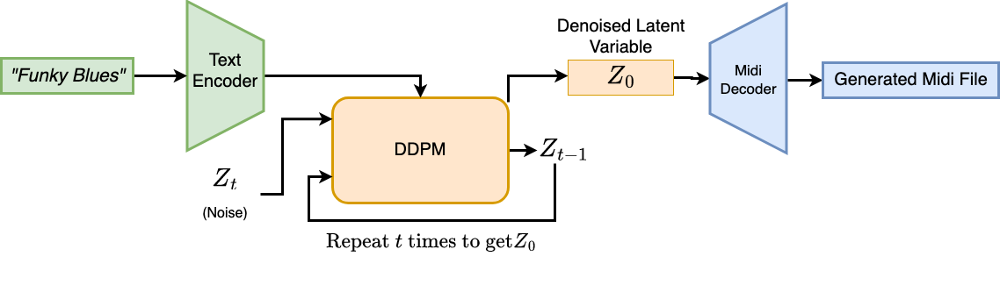
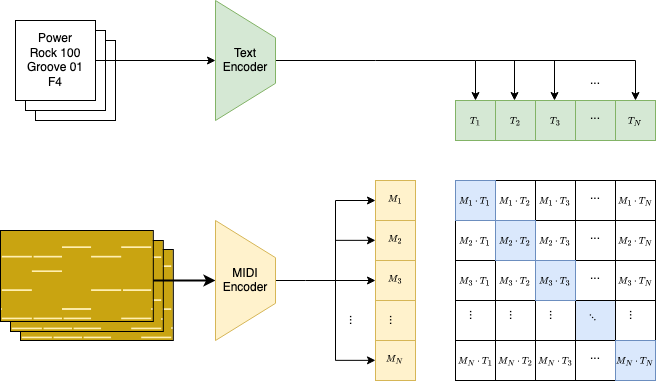
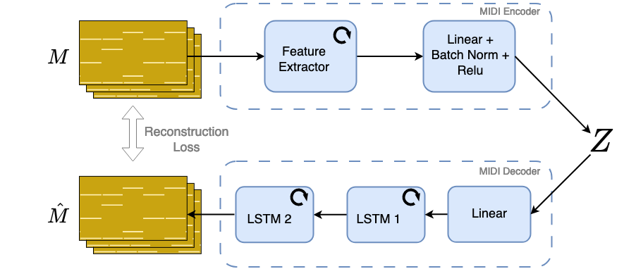

<p align="center">
  
  
  
</p>

# BeatBrewer: Text-Conditioned Drumbeat Generation

> 🎶 Published at [SMC 2025 — Sound and Music Computing Conference](https://smc25.iem.at/), Graz

This repository provides code for generating symbolic drumbeats from natural language descriptions (text prompts) using **Latent Diffusion Models (LDMs)**. This was developed as part of the research presented in our SMC 2025 paper and introduces a multi-stage training pipeline combining multimodal pretraining, autoencoding, and diffusion modeling.

---

## 🧠 Project Overview

<p align="center">
  
</p>

We present a three-stage pipeline to synthesize drumbeats conditioned on text:

1. **Multimodal Pretraining**  
   Pretrain a text encoder and MIDI encoder into a **joint embedding space** using contrastive loss (inspired by CLIP).  
   📁 See: `text_supervised_pretraining/`

   <p align="center">
     
   </p>

2. **Autoencoder Training**  
   Use a novel **MultiResolutionLSTM** to learn a latent representation of MIDI pianorolls. The model is trained to reconstruct the original sequence from the latent.  
   📁 See: `Midi_Encoder/`

   <p align="center">
     
   </p>

3. **Latent Diffusion Modeling**  
   A DDPM is trained to denoise latent vectors over 1000 timesteps, conditioned on text embeddings from the pretrained encoder.  
   📄 Script: `DDPM/main_latent_space.py`  
   🔄 Inference: `DDPM/demo.py`

---

## 📦 Installation & Inference

> ⚠️ **Note:** Model weights are _not_ included in this repository at the moment due to licensing checks with the data provider.

### 🔧 Setup

1. Create a Conda environment and install dependencies:

```bash
# Create and activate env (Python 3.10+ recommended)
conda create -n beatbrewer python=3.10
conda activate beatbrewer

# Install dependencies
pip install pyyaml tqdm torch numpy matplotlib scikit-learn transformers
pip install git+https://github.com/jmmcd/python-midi/
````

2. Clone this repo:

```bash
git clone git@github.com:pushkarjajoria/BeatBrewer.git
cd BeatBrewer
```

3. Set Python path:

```bash
export PYTHONPATH=$(pwd):$PYTHONPATH
```

4. Place the pretrained weights in a folder called `demo_models/` in the root directory.

### ▶️ Run Inference

```bash
python DDPM/demo.py
```

* Generated MIDI files will appear in `demo_midi_files/`.
* Each drumbeat is conditioned on a prompt derived from the Groove Monkee dataset filenames.

---

## 📊 Evaluation

<p align="center">
  
</p>

We evaluated the generated drumbeats using:

* **Binary pianoroll & latent distance** to assess novelty
* **Listening tests** for quality and prompt relevance

---

## 📚 Citation

If you use this code or refer to the paper, please cite:

```bibtex
@inproceedings{jajoria_2025_15838008,
  author       = {Jajoria, Pushkar and Klakow, Dietrich and McDermott, James},
  title        = {Text Conditioned Symbolic Drumbeat Generation using Latent Diffusion Models},
  booktitle    = {Proc. 22nd Sound and Music Computing Conference (SMC2025)},
  year         = {2025},
  pages        = {311--318},
  publisher    = {IEM, University of Music and Performing Arts Graz},
  month        = jul,
  venue        = {Graz, Austria},
  doi          = {10.5281/zenodo.15838008},
  url          = {https://doi.org/10.5281/zenodo.15838008},
}
```

---

## 📄 License

The code is released under a permissive open license. You may use and adapt it freely, but please give credit by citing the paper above.

---

<p align="center">
  <i>Developed at Saarland University, University of Galway.</i>
</p>
```

---